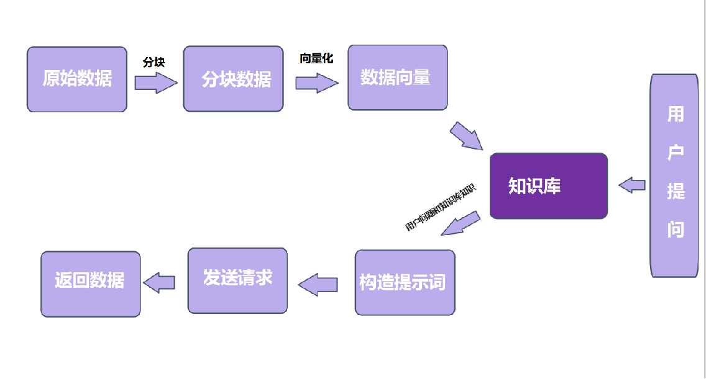
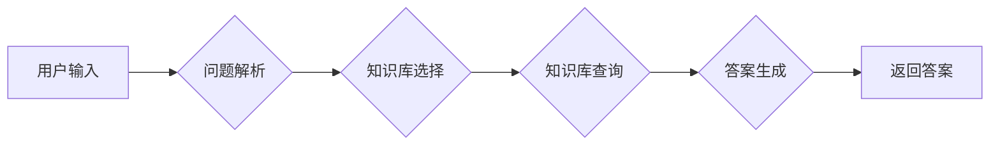

# 一篇搞懂RAG技术

## RAG技术

### RAG技术是什么

RAG技术是一种基于大语言模型（LLM）的问答技术，它能够通过调用多个知识库来回答用户的问题。RAG技术的主要特点包括：

- **多知识库调用**：RAG技术能够同时调用多个知识库，从而获取更全面、更准确的信息。这使得RAG技术能够回答更复杂、更深入的问题。
- **多轮对话**：RAG技术支持多轮对话，用户可以与RAG系统进行多次交互，从而逐步获取所需的信息。
- **个性化定制**：RAG技术可以根据用户的需求和偏好，自动选择最合适的知识库进行调用，从而提供更个性化的回答。

### RAG技术的应用场景

RAG技术可以广泛应用于各种场景，包括：

- **智能客服**：RAG技术可以用于智能客服系统，通过调用多个知识库来回答用户的问题，从而提高客服的效率和准确性。
- **教育领域**：RAG技术可以用于教育领域，通过调用多个知识库来回答学生的问题，从而帮助学生更好地理解和掌握知识。
- **企业内部知识管理**：RAG技术可以用于企业内部知识管理，通过调用多个知识库来回答员工的问题，从而提高企业的知识管理水平。

### RAG技术的实现原理

RAG技术的实现原理主要包括以下几个步骤：

1. **用户输入**：用户通过自然语言输入问题。
2. **问题解析**：RAG系统对用户输入的问题进行解析，包括问题类型、关键词等。
3. **知识库选择**：RAG系统根据问题解析结果，选择最合适的知识库进行调用。可以选择一个或多个知识库。
4. **知识库查询**：RAG系统对选定的知识库进行查询，获取与问题相关的信息。
5. **答案生成**：RAG系统根据查询结果，生成答案并返回给用户。

### RAG技术的优势

RAG技术的优势主要包括：

- **多知识库调用**：RAG技术能够同时调用多个知识库，从而获取更全面、更准确的信息。
- **多轮对话**：RAG技术支持多轮对话，用户可以与RAG系统进行多次交互，从而逐步获取所需的信息。
- **个性化定制**：RAG技术可以根据用户的需求和偏好，自动选择最合适的知识库进行调用，从而提供更个性化的回答。

### RAG技术的挑战

RAG技术的挑战主要包括：

- **知识库选择**：如何选择最合适的知识库进行调用，是一个需要解决的问题。
- **多轮对话管理**：如何管理多轮对话，确保用户能够逐步获取所需的信息，是一个需要解决的问题。
- **个性化定制**：如何根据用户的需求和偏好，自动选择最合适的知识库进行调用，是一个需要解决的问题。

### RAG技术的未来发展趋势

RAG技术的未来发展趋势主要包括：

- **知识库融合**：如何将多个知识库进行融合，提高知识库的利用率，是一个需要解决的问题。
- **多模态问答**：如何实现多模态问答，即同时处理文本、图像、音频等多种形式的信息，是一个需要解决的问题。
- **个性化推荐**：如何根据用户的需求和偏好，实现个性化的推荐，是一个需要解决的问题。

## 技术框架图

### mermaid

